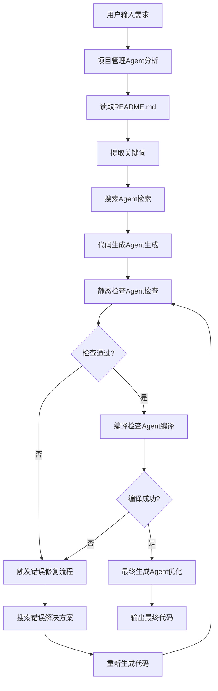

# 鸿蒙工作流技术文档

## 系统架构概览

### 核心组件
本系统基于**MCP (Model Context Protocol)** 协议构建的多Agent协作系统，专门针对鸿蒙(HarmonyOS)应用开发进行优化。

```
┌─────────────────────────────────────────────────────────────┐
│                   MCP Coordinator                           │
│  ┌─────────────────────────────────────────────────────┐    │
│  │            HarmonyOS Workflow Manager               │    │
│  │                                                     │    │
│  │  ┌──────────┐ ┌──────────┐ ┌──────────┐ ┌──────────┐│    │
│  │  │Project   │ │Search    │ │Code      │ │Code      ││    │
│  │  │Manager   │ │Agent     │ │Generator │ │Checker   ││    │
│  │  │Agent     │ │          │ │Agent     │ │Agent     ││    │
│  │  └──────────┘ └──────────┘ └──────────┘ └──────────┘│    │
│  │                                                     │    │
│  │   ┌──────────────────────────────────┐              │    │
│  │   │      Error Fix Workflow          │              │    │
│  │   │    (Loop Manager)                │              │    │
│  │   │                                  │              │    │
│  │   └──────────────────────────────────┘              │    │
│  └─────────────────────────────────────────────────────┘    │
└─────────────────────────────────────────────────────────────┘
```

## 关键技术实现

### 1. 工作流管理 (`harmonyos_workflow.py`)

#### 工作流状态管理
```python
@dataclass
class WorkflowExecutionState:
    session_id: str          # 会话唯一标识
    user_input: str          # 用户输入需求
    current_step: WorkflowStep  # 当前执行步骤
    context: Dict[str, Any]  # 执行上下文
    is_fixing: bool = False  # 是否在修复模式
    loop_count: int = 0      # 循环计数
    max_loops: int = 3       # 最大循环次数
    errors: List[Dict[str, Any]] = None  # 错误记录
```

#### 工作流步骤配置
系统采用声明式配置定义工作流：
```python
self.workflow_steps = {
    WorkflowStep.ANALYZE_REQUIREMENTS: {
        "agent": "project_manager",
        "method": "project.analyze_harmonyos_requirements",
        "next_step": WorkflowStep.SEARCH_INFORMATION,
        "required_params": ["requirement", "project_path"],
        "can_skip": False
    },
    # ... 其他步骤
}
```

### 2. Agent架构设计

#### 基础Agent类 (`mcp_agent.py`)
所有Agent继承自统一的基础类：
```python
class MCPAgent:
    async def initialize(self) -> Dict[str, Any]
    async def handle_request(self, message: MCPMessage) -> Dict[str, Any]
    async def cleanup(self) -> Dict[str, Any]
    def get_agent_info(self) -> Dict[str, Any]
```

#### Agent专用LLM配置
支持每个Agent使用不同的LLM模型：
- **项目管理Agent**: DeepSeek-Reasoner (适合复杂推理和规划)
- **代码生成Agent**: Claude-3.5-Haiku (高质量代码生成)
- **最终生成Agent**: DeepSeek-Reasoner (代码优化)

### 3. 循环修复机制 (`loop_manager.py`)

#### 错误检测与分类
```python
async def should_continue_loop(self, session_id: str, 
                              compile_result: Dict[str, Any], 
                              static_result: Dict[str, Any]) -> tuple[bool, str]:
    """基于编译和静态检查结果判断是否需要继续循环"""
    # 检测编译错误
    if compile_result.get("success") is False:
        return True, "编译失败，需要修复"
    
    # 检测静态检查问题
    if static_result.get("issues_found"):
        return True, "发现代码质量问题，需要修复"
    
    return False, "所有检查通过"
```

#### 修复上下文生成
```python
async def generate_fix_context(self, session_id: str) -> Dict[str, Any]:
    """为修复流程生成上下文信息"""
    return {
        "search_keywords": self._extract_error_keywords(errors),
        "fix_instructions": self._generate_fix_instructions(errors),
        "code_context": self._get_current_code_context()
    }
```

## 技术特性详解

### 1. 鸿蒙特定优化

#### 代码生成策略
- **模型选择**: 使用DeepSeek推理模型确保代码质量
- **模板优化**: 针对ArkTS语法和鸿蒙组件API优化提示词
- **文件定位**: 直接操作 `MyApplication2/entry/src/main/ets/pages/Index.ets`

#### 检查工具集成
```bash
# 静态检查 (限制：仅在MyApplication2目录内使用)
cd MyApplication2 && codelinter

# 编译检查 (集成hvigorw)
cd MyApplication2 && hvigorw --mode project -p product=default assembleApp --analyze=normal --parallel --incremental --daemon
```

### 2. 配置管理系统

#### 统一配置文件 (`config/config.yaml`)
```yaml
# 全局LLM配置
provide_settings:
  llm:
    provider: "Anthropic"
    config:
      model: "claude-3-5-sonnet-20241022"
      
# Agent专用配置覆盖
agents:
  code_generator:
    llm_override:
      provider: "OpenAI"
      config:
        model: "claude-3-5-haiku-20241022"
```

#### 动态配置加载
```python
class ConfigLoader:
    def get_llm_config(self, agent_name: str = None) -> Dict[str, Any]:
        """获取LLM配置，支持Agent专用覆盖"""
        base_config = self.config.get("provide_settings", {}).get("llm", {})
        
        if agent_name:
            agent_config = self.config.get("agents", {}).get(agent_name, {})
            override_config = agent_config.get("llm_override", {})
            if override_config:
                return override_config
                
        return base_config
```

### 3. 错误处理与恢复

#### 多层错误处理
1. **Agent级别**: 单个Agent执行失败的恢复
2. **工作流级别**: 步骤执行失败的重试机制  
3. **循环级别**: 基于检查结果的智能修复

#### 错误信息收集
```python
async def _prepare_next_loop(self, state: WorkflowExecutionState, 
                           workflow_result: Dict[str, Any], reason: str):
    """收集错误信息并准备下一次修复循环"""
    step_results = workflow_result.get("step_results", {})
    
    # 收集编译错误
    compile_errors = step_results.get("compile_check", {}).get("errors", [])
    # 收集静态检查问题
    static_issues = step_results.get("static_check", {}).get("issues_found", [])
    
    state.errors.extend(compile_errors + static_issues)
```

## 数据流设计

### 1. 工作流一：初始代码生成



### 2. 参数传递机制

#### 步骤间参数传递
```python
async def _prepare_step_params(self, state: WorkflowExecutionState, 
                              step: WorkflowStep) -> Dict[str, Any]:
    """为每个步骤准备特定参数"""
    if step == WorkflowStep.GENERATE_CODE:
        return {
            "requirement": state.user_input,
            "context": state.context.get("search_context", ""),
            "target_files": state.context.get("target_files", []),
            "is_fixing": state.is_fixing,
            "previous_errors": state.errors if state.is_fixing else []
        }
```

#### 上下文累积更新
```python
# 执行步骤后更新上下文
step_result = await self._execute_step(state, current_step)
state.context.update(step_result["data"])
```

## 性能优化

### 1. 并发执行
- Agent之间支持并发调用
- 非阻塞的异步执行模式
- 智能超时控制

### 2. 缓存机制
- 搜索结果缓存
- 配置解析缓存
- 编译结果缓存

### 3. 资源管理
```python
# 工作流完成后自动清理
if session_id in self.active_workflows:
    del self.active_workflows[session_id]
```

## 扩展接口

### 1. 新增Agent
```python
# 1. 继承基础Agent类
class CustomAgent(MCPAgent):
    async def handle_request(self, message: MCPMessage) -> Dict[str, Any]:
        # 实现自定义逻辑
        pass

# 2. 在协调器中注册
self.agents["custom_agent"] = CustomAgent(config)

# 3. 在配置文件中添加配置
agents:
  custom_agent:
    description: "自定义Agent"
    enabled: true
```

### 2. 新增工作流步骤
```python
# 在workflow_steps中添加新步骤
WorkflowStep.CUSTOM_STEP: {
    "agent": "custom_agent",
    "method": "custom.method",
    "next_step": WorkflowStep.EXISTING_STEP,
    "required_params": ["param1", "param2"]
}
```

## 监控与调试

### 1. 日志系统
```python
# 结构化日志记录
logger.info(f"执行步骤: {step.value} -> {agent_id}.{method}")
logger.error(f"步骤 {step.value} 执行失败: {e}")
```

### 2. 状态查询
```python
def get_workflow_status(self, session_id: str) -> Optional[Dict[str, Any]]:
    """实时查询工作流执行状态"""
    return {
        "session_id": session_id,
        "current_step": state.current_step.value,
        "is_fixing": state.is_fixing,
        "loop_count": state.loop_count,
        "total_errors": len(state.errors)
    }
```

### 3. 统计信息
```python
self.stats = {
    "total_requests": 0,
    "successful_requests": 0,
    "failed_requests": 0,
    "agent_usage": {},
    "workflow_usage": {}
}
```

## 安全考虑

### 1. 输入验证
- 用户输入的sanitization
- 参数类型检查
- 文件路径验证

### 2. 资源限制
- 执行超时控制
- 内存使用限制
- 并发请求数量限制

### 3. 错误隔离
- Agent执行失败不影响其他Agent
- 工作流异常不影响系统稳定性
- 自动错误恢复机制

## 部署配置

### 1. 环境要求
```yaml
# 系统要求
python: ">=3.10"
memory: ">=4GB"
disk: ">=10GB"

# 依赖服务
api_services:
  - DeepSeek API
  - Anthropic API
  - OpenAI API (可选)
```

### 2. 配置文件模板
```yaml
# 生产环境配置
api:
  host: "0.0.0.0"
  port: 8000
  
logging:
  level: "INFO"
  file: "logs/production.log"
  
workflows:
  harmonyos_complete_development:
    timeout: 1800
    loop_config:
      max_iterations: 3
```

这个技术文档详细描述了系统的架构设计、关键实现和扩展方式，为开发者提供了完整的技术参考。